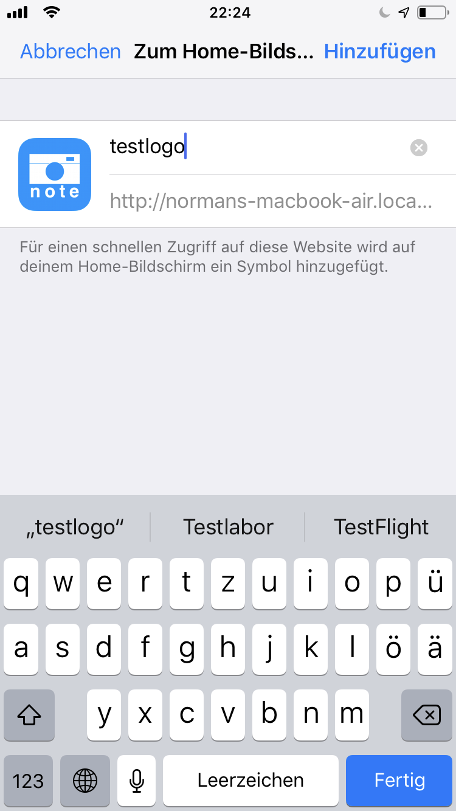

# iOS App Logo Development

This simple project should help to develop a logo for your iOS App.

start the example webapp

```
ruby -run -e httpd webside -- bind-address="0.0.0.0"
```

Open the webapp in the browser of your iPhone
```
echo "http://$(hostname):8080"
```

then add the webapp to your home screen

like in this picture



and finaly it looks like this


